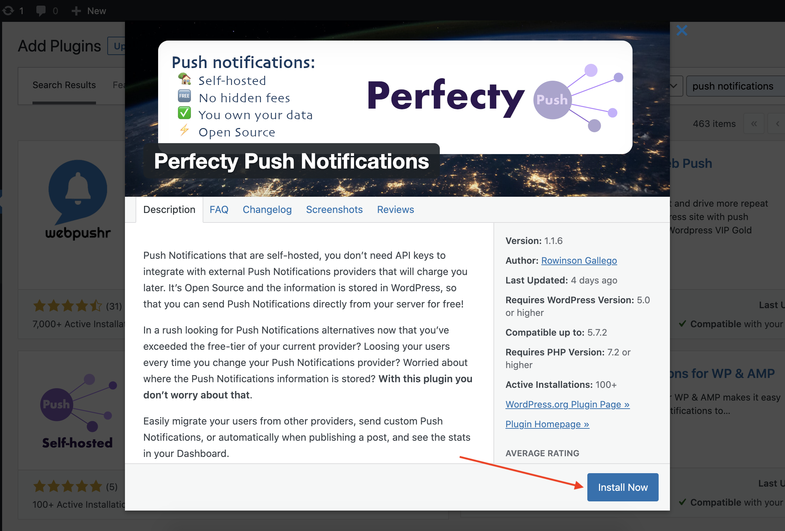
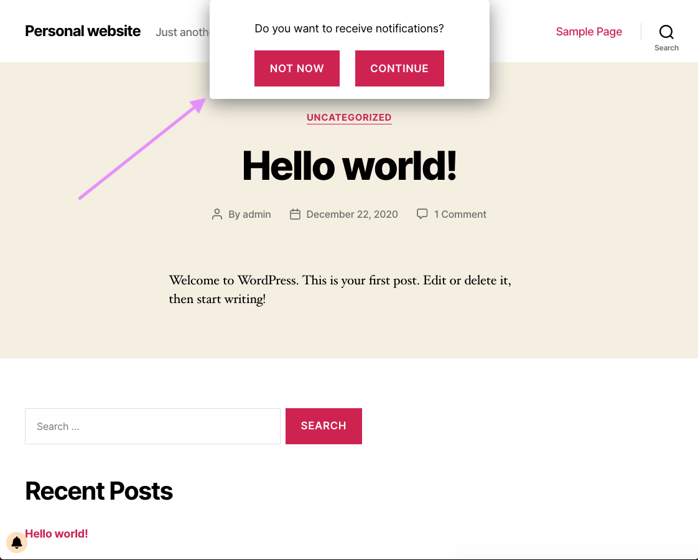
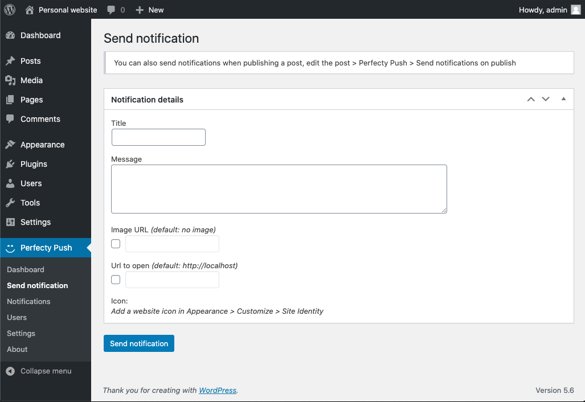
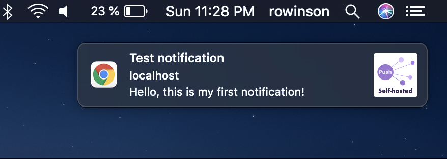

Using Perfecty Push is really simple if you have all the requirements.

## 1. Installation

Install the plugin from the [WordPress plugin directory](https://wordpress.org/plugins/perfecty-push-notifications/).

## 2. Visit your Front page

After activating the plugin go to your website front page, you should see a dialog asking to subscribe. Click on `Continue` and allow notifications when your browser prompts it.

## 3. Send your first notification

You're now a subscriber and we will send our first notification. In the admin area go to `Perfecty Push > Send notification`.

Fill in the `Title` and `Message` fields, and click `Send notification`.

That's it, you should receive your first notification! 🎉

