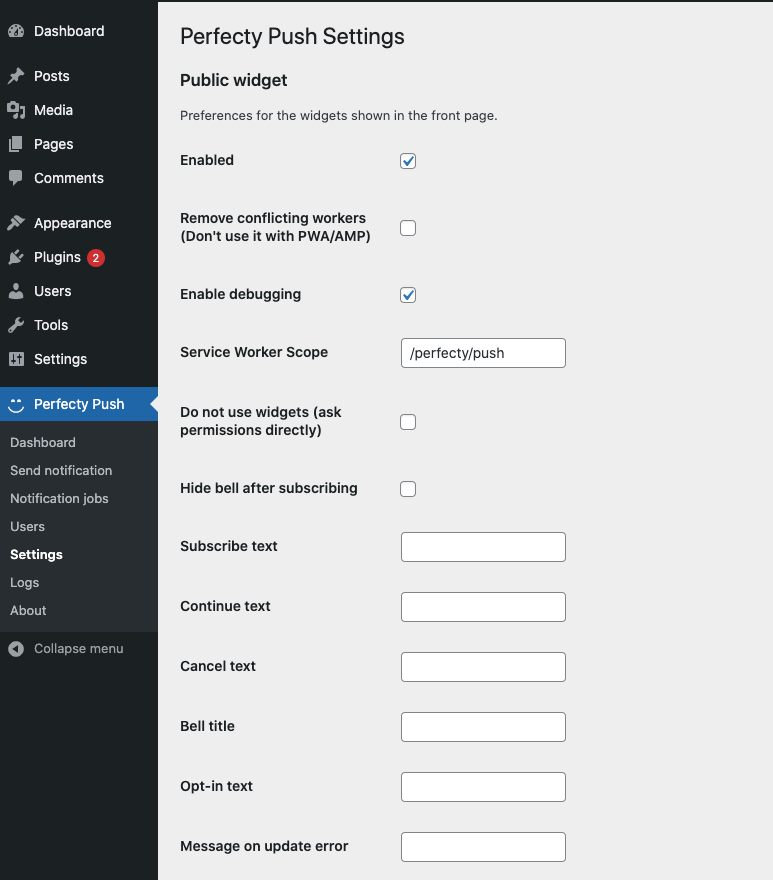
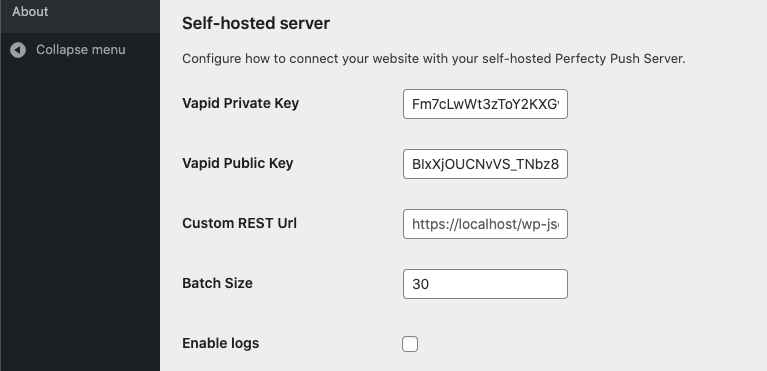
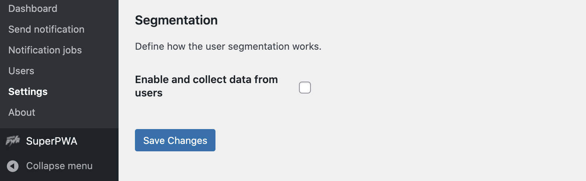

There are currently three different areas you can configure:

## 1. Public widget

They are for the frontend widgets (The Subscription dialog and the Bell button) and the Javascript SDK.

Each of the values is described below:

Property | Default value | Description
--- | --- | ---
Enabled | `True` | Show the widget in your website public frontend.
Remove conflicting workers (Don't use it with PWA/AMP) | `False` | Removes all the workers from all the scopes (useful when migrating from another provider). Don't use this in a PWA/AMP website.
Enable debugging | `False` | Enable the debugging in the JS SDK. Useful for troubleshooting.
Service Worker Scope | `/perfecty/push` | This is the scope of the service worker. By default we use a value different than root `(/)`
Do not use widgets (ask permissions directly) | `False` | Ask permissions right after the use visits the website. Don't use the dialog/bell controls.
Hide bell after subscribing | `False` | Hides the bell after the user has subscribed to your website. Note that the user will not have a way to unsubscribe and will be forced to revoke you the Browser permissions.
Subscribe text | `''` | This is the text of the question asked to the user for subscribing to Push Notifications. (Default: `Do you want to receive notifications?`)
Continue text | `''` | Text of the Button to continue (Default: `Continue`)
Cancel text | `''` | Text of the Button to cancel (Default: `Cancel`)
Bell title | `''` | Title of the Settings dialog when the Bell icon is clicked (Default: `Notifications preferences`)
Opt-in text | `''` | Text of the Opt-in checkbox (Default `I want to receive notifications`)
Message on update error | `''` | Text shown when there's an error updating the preferences (Default: `Could not change the preference, please try again`)

## 2. Self-hosted server

Define the options for your self-hosted Push Server.

You can define the following values:

Property | Default value | Description
--- | --- | ---
Vapid Private Key | Auto generated | Private VAPID Key
Vapid Public Key | Auto generated | Public VAPID Key (Used in the JS SDK)
Custom REST Url | The value returned by [`get_rest_url()`](https://developer.wordpress.org/reference/functions/get_rest_url/) | This is the REST API url to call from the Javascript SDK
Batch Size | `30` | The number of notifications to send in each batch. Each execution from `wp-cron` will send this number of push messages and will continue in the next cycle.
Enable logs | `False` | Enables the logs in the server side.

## 3. Segmentation

This is for the user segmentation capabilities (still under development).

For the moment it supports the following values:

Property | Default value | Description
--- | --- | ---
Enable and collect data from users | `False` | If enabled it will collect and store the IP address from the subscribers.
