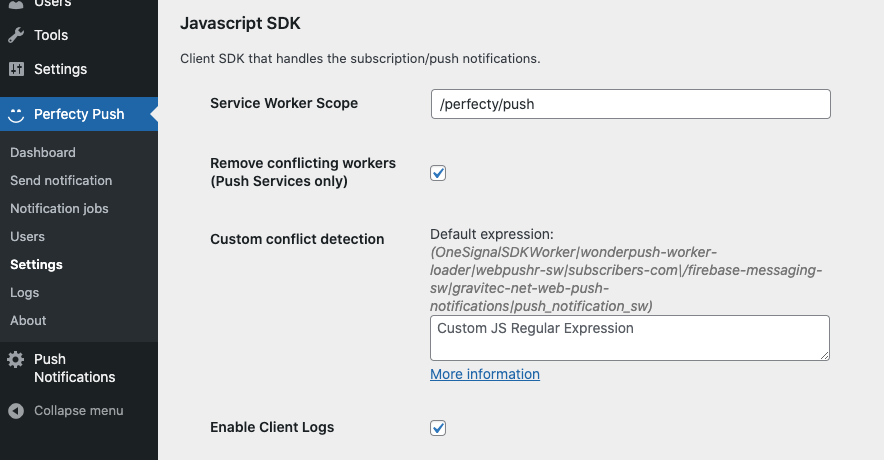
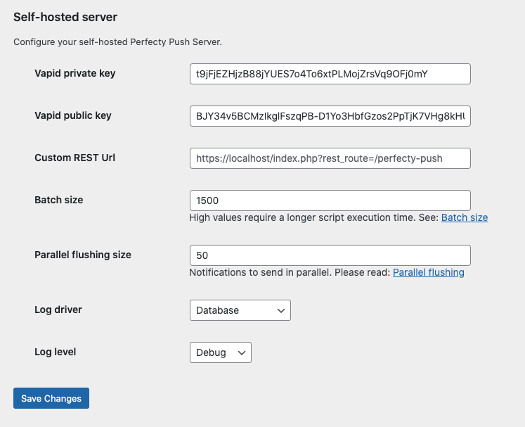

These are the different areas you can configure:

## 1. Public widget

They affect the controls shown in the front page (the Subscription prompt/the Bell icon).

Each of the values is described below:

Setting | Default value | Description
--- | --- | ---
Enabled | `True` | Show the widget in your website public frontend.
Display after this number of visits | `0` | Required number of visits to the website before displaying the subscription prompt.
Do not use widgets (ask permissions directly) | `False` | Ask permissions right after the use visits the website. Will not show the dialog/bell controls.
Hide bell after subscribing | `False` | Hides the bell after the user has subscribed to your website. Note that the users will not have a way to unsubscribe and will be forced to revoke you the Browser permissions.
Subscribe text | `''` | This is the text of the question asked to the user for subscribing to Push Notifications. (Default: `Do you want to receive notifications?`)
Continue text | `''` | Text of the Button to continue (Default: `Continue`)
Cancel text | `''` | Text of the Button to cancel (Default: `Cancel`)
Bell title | `''` | Title of the Settings dialog when the Bell icon is clicked (Default: `Notifications preferences`)
Opt-in text | `''` | Text of the Opt-in checkbox (Default `I want to receive notifications`)
Message on update error | `''` | Text shown when there's an error updating the preferences (Default: `Could not change the preference, please try again`)

## 2. Javascript SDK

They define how the SDK performs the registration and the Push Notifications.

Setting | Default value | Description
--- | --- | ---
Service Worker Scope | `/perfecty/push` | This is the scope of the service worker. By default we use a value different than root `(/)`
Remove conflicting workers (Don't use it with PWA/AMP) | `False` | Removes all the workers from all the scopes (useful when migrating from another provider). Don't use this in a PWA/AMP website.
Custom conflict detection | `''` | Specify a custom JS regex expression to remove specific conflicting Service Workers.  [More information](./conflict-resolution/)   Default expression: `(OneSignalSDKWorker|wonderpush-worker-loader|webpushr-sw|subscribers-com\/firebase-messaging-sw|gravitec-net-web-push-notifications|push_notification_sw)`
Enable Client Logs| `False` | Enable the logs in the client (which uses the Javascript SDK). Useful for troubleshooting.

## 3. Notifications

Change the notifications that the users receive in their Browsers/Mobiles.

Setting | Default value | Description
--- | --- | ---
Fixed notifications (do not auto hide) | `False` | If checked the notifications will not disappear. Otherwise, they will fade out automatically after a couple of seconds.
Default Icon | `Website's icon` | The default icon to be sent in all the notifications.

## 4. Segmentation and Tracking

This is for the user segmentation capabilities (still under development).

For the moment it supports the following values:

Property | Default value | Description
--- | --- | ---
Enable and collect data from users | `False` | If enabled it will collect and store the IP address from the subscribers.
UTM analytics | `''` | Paste the UTM Tracking for Google Analytics, for example: `utm_source=perfecty-push&utm_medium=web-push&utm_campaign=my-campaign-name`.

## 5. Post publishing

How to send notifications automatically after publishing a Post. 

Setting | Default value | Description
--- | --- | ---
Always send a notification | `False` |  It will always send a Push Notification when a Post is published. You can define it per post in the Post's metabox.

## 6. Self-hosted server

Define the options for your self-hosted Push Server.

You can define the following values:

Property | Default value | Description
--- | --- | ---
Vapid Private Key | Auto generated | Private VAPID Key
Vapid Public Key | Auto generated | Public VAPID Key (Used in the JS SDK)
Custom REST Url | The value returned by [`get_rest_url()`](https://developer.wordpress.org/reference/functions/get_rest_url/) | This is the REST API url to call from the Javascript SDK
Batch Size | `1500` | Number of notifications to fetch from the Database in each sending loop. The higher the number requires higher memory, approx. `3052 * batch_size bytes`. For `1500`, it means `~4,36Mb` of RAM as maximum.
Parallel Flushing Size | `50` | Number of concurrent notifications to send. A high value can cause Out Of Memory errors, so please adjust with caution according to your server specs. See: [Performance improvements](./performance-improvements/)
Enable Server Logs | `False` | Enables the logs in the Push Server.
