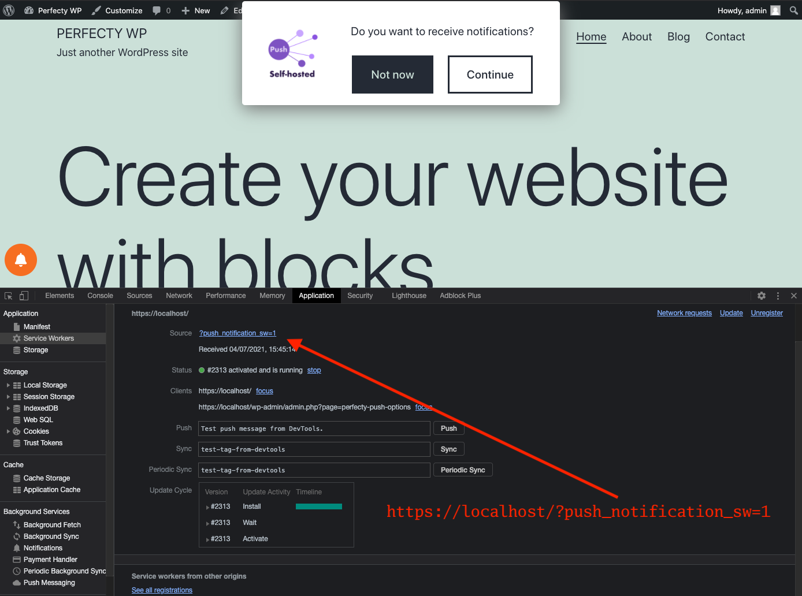
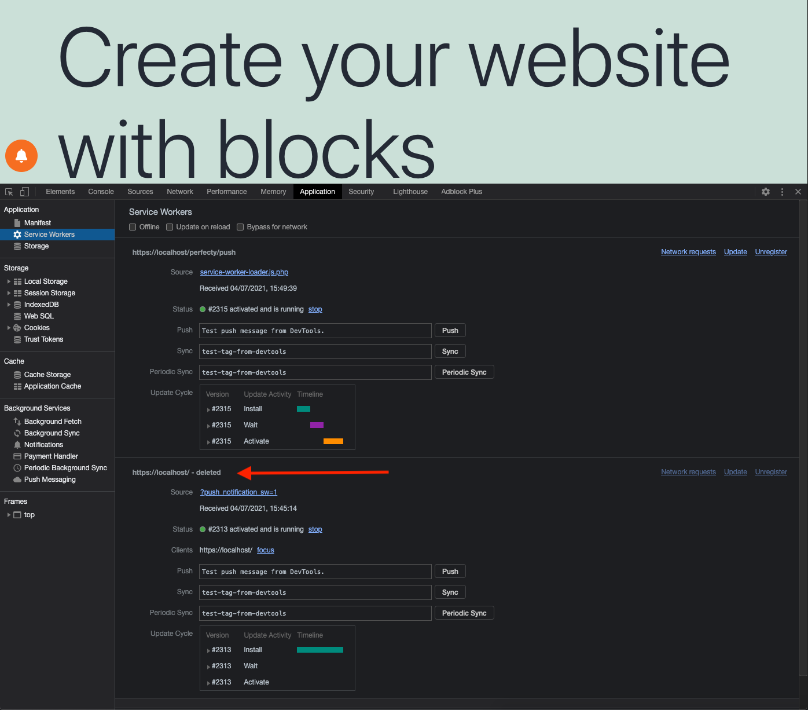
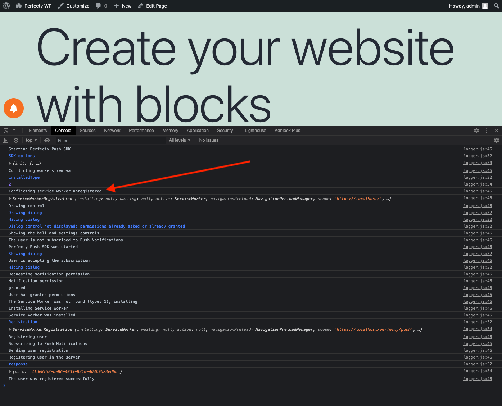
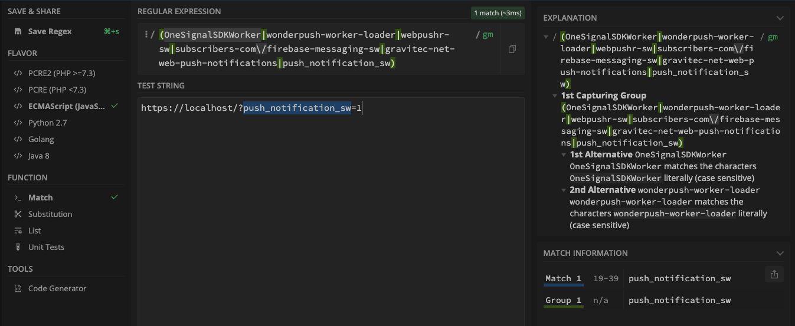

If you have previously installed external
Push Notifications providers, it's very common that their Service Workers stay idle in your visitor's Browsers.
Check out what is a Service Worker at [https://developers.google.com/web/fundamentals/primers/service-workers](https://developers.google.com/web/fundamentals/primers/service-workers).

Perfecty Push needs to uninstall those service workers because ideally you should only have one Service Worker that
receives and processes all the Push Notifications sent by your self-hosted server.

Note that by removing those old workers, it won't affect the PWA/AMP service workers because their URL doesn't match the default JS Regex detection.

## How to remove old Service Workers

In order to remove those old and idle Service Workers, you need to activate the `Remove conflicting workers (Push Services only)`
option, and if you want to troubleshoot the whole removal process in the Browser check the `Enable Client Logs` option, and
deactivate it after you're done.


All the options are described in [Configuration](./configuration/).


## Example

In this example even if we deactivate the old plugin, their service worker stays active in the visitor's browser.

The old Service Worker is still installed in your Browser, if you open the Chrome's Developer Tools > Application > Service Workers you will see it with this URL:

```
https://localhost/?push_notification_sw=1
```

Perfecty Push worker will have this URL:

```
https://localhost/wp-content/plugins/perfecty-push-wp/public/js/service-worker-loader.js.php
```

### Conflicting Service Worker

The old Service Worker is still installed and active, even if you've uninstalled the old plugin from WordPress.



### Automatic Removal

After enabling the `Remove conflicting workers (Push Services only)` option, the conflicting worker is deleted by
Perfecty Push and the new one is installed.



### Client logs

You can see in the logs that the conflicting worker was detected and removed.



## Custom detection

By default, Perfecty Push uses the following Javascript Regex to detect the potential conflicting workers from known third party providers:

```
(OneSignalSDKWorker|wonderpush-worker-loader|webpushr-sw|subscribers-com\/firebase-messaging-sw|gravitec-net-web-push-notifications|push_notification_sw)
```

You can create your own and validate the resulting expression in [https://regex101.com/](https://regex101.com/) using the `ECMAScript (JavaScript)` flavor:



In _Test String_ use the conflicting worker URL as you can see it in the Chrome's Web Inspector, for the example described above it was: `https://localhost/?push_notification_sw=1`.

In this validation you can see that it has 1 match.
