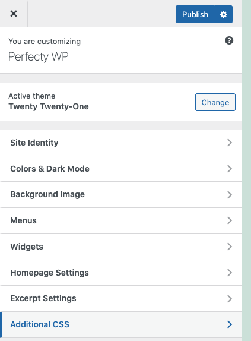
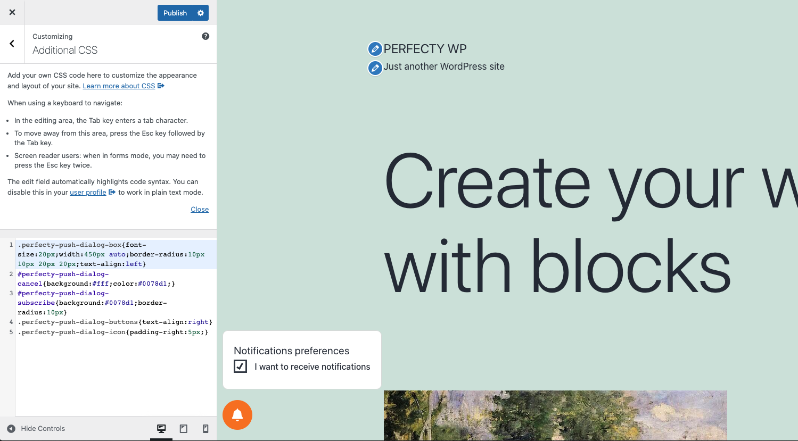

The original CSS styles that you can extend and customize are defined in the
[public/css/perfecty-push-public.css](https://github.com/perfectyorg/perfecty-push-wp/blob/master/public/css/perfecty-push-public.css)
file. Instead of editing that file directly, it's smarter to extend it and adjust it using custom CSS.

## Extend the CSS styles

In the WordPress admin section go to `Appareance > Customize`. It will open the WordPress live editor:



In the left pane click in `Additional CSS` and customize the `perfecty-push-*` CSS classes and IDs.



Example:

```css
.perfecty-push-dialog-box{font-size:20px;width:450px auto;border-radius:10px 10px 20px 20px;text-align:left}
#perfecty-push-dialog-cancel{background:#fff;color:#0078d1;}
#perfecty-push-dialog-subscribe{background:#0078d1;border-radius:10px}
.perfecty-push-dialog-buttons{text-align:right}
.perfecty-push-dialog-icon{padding-right:5px;}
```

You need to know about CSS and how it works. If you don't, it's better to hire or ask for help to someone who knows it. 
**Please don't submit support tickets related to styles, as they are highly dependent and relative on your own theme.**

### Mobile styles

To change the values shown in Mobile devices, look for the values with `@media` similar to the ones below in 
the [original CSS definition](https://github.com/perfectyorg/perfecty-push-wp/blob/master/public/css/perfecty-push-public.css):

```css
@media only screen and (max-width: 370px) {
  .perfecty-push-dialog-box {
	width: 320px;
	flex-wrap: wrap;
  }
}
```