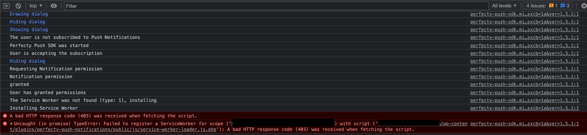

## Determine root causes

Most likely the errors you face are related to your server configuration settings (server parameters/security policies/proxy params).
To get a better idea on what could be causing them you can enable the logs in your Server or Client side.

### Server side logs

#### 1. Enable the server logs

Go to `Perfecty Push > Settings > Self-hosted server` and use the `info` or `warning` level in the `Log level` option. 

#### 2. Check the logs

If the Log driver is `PHP - error_log()`, you can see the logs in your CPanel or Server administration logs section. Please read [this post in Stackoverflow](https://stackoverflow.com/questions/5127838/where-does-php-store-the-error-log-php-5-apache-fastcgi-and-cpanel)

If the Log driver is `Database`, the logs can be found in `Perfecty Push > Logs`.

Look for any related information when your problem happens.

### Client side logs

Sometimes, the root cause of the problem is in how the Javascript SDK in the Browser interacts with the server.

#### 1. Enable the client logs

To find any potential issues, you need to activate the `Enable client logs` option in `Perfecty Push > Settings > Javascript SDK`.

#### 2. Ckeck the logs

To view the logs in Chrome you need to activate the Developer tools in `Main menu > More tools > Developer Tools > Console`. Once opened,
reload the page and see for any potential error message.

## User registration fails

If you act as an end user and opt-in for Push Notifications, the browser is registered in your website
and it should be listed in the users list in `Perfecty > Users`.

However, in some cases this registration process fails because your server doesn't allow the `*js.php` extension files.
If you open the Developer tools in Chrome via `Chrome > More tools > Developer tools`, you see something like this:



The `.js.php` extension is needed to inject the Service Worker Scope headers in 
[https://github.com/perfectyorg/perfecty-push-wp/blob/master/public/js/service-worker-loader.js.php](https://github.com/perfectyorg/perfecty-push-wp/blob/master/public/js/service-worker-loader.js.php).

Have in mind that this is also the same file extension used by OneSignal.

## Better performance

For better performance we recommend enabling the `gmp` extension (GNU Multiple Precision).

Please read [How to improve performance](./performance-improvements).

## How to install the gmp extension

In Ubuntu you would do:

```bash
sudo apt-get install php7.2-gmp

# then restart apache with
sudo service apache2 restart

# or php-fpm (nginx)
sudo service php-fpm restart
```

## Cannot generate the VAPID keys automatically

This happens if you have PHP <= 7.2 and miss the `gmp` extension. Perfecty Push will be disabled until you install the `gmp` extension or generate the keys manually.

### 1. Install the gmp extension

Follow the instructions above, and then deactivate/activate the plugin from the WordPress plugin UI. This will generate the keys automatically for you.

### 2. Generating the VAPID keys manually using `openssl`

From your WordPress server run:

```bash
openssl ecparam -genkey -name prime256v1 -out private_key.pem
openssl ec -in private_key.pem -pubout -outform DER|tail -c 65|base64|tr -d '=' |tr '/+' '_-' > public_key.txt
openssl ec -in private_key.pem -outform DER|tail -c +8|head -c 32|base64|tr -d '=' |tr '/+' '_-' > private_key.txt

cat private_key.txt
cat public_key.txt
```

Once you've created the keys, set those values in Perfecty Push > Settings > Vapid Private Key / Vapid Public Key.

**However, the recommended solution is to install and enable the `gmp` extension.**

## The VAPID keys are missing in Perfecty Push. Generate the VAPID keys.

This is due to two reasons:
- You use PHP 7.2 and you didn't have the `gmp` extension enabled, however now you have it.
- You have deleted the VAPID keys from the Settings.

In any case, you can generate them automatically by deactivating/activating your plugin from the WordPress plugin UI (this won't remove your data).

## Conflicts with external Service Workers

Read the section [Conflict Resolution](./conflict-resolution)
